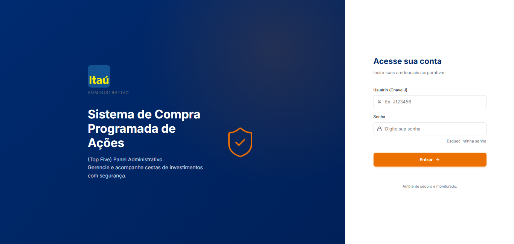
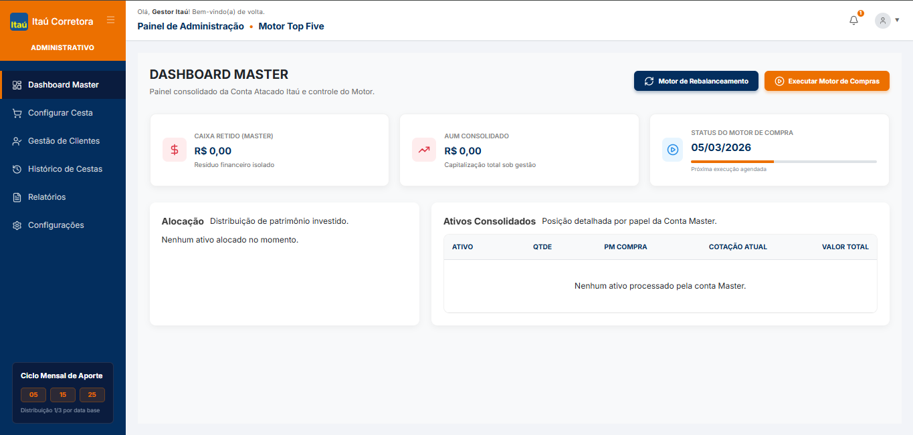
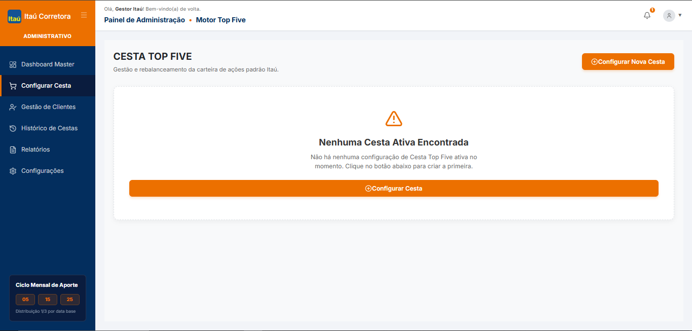
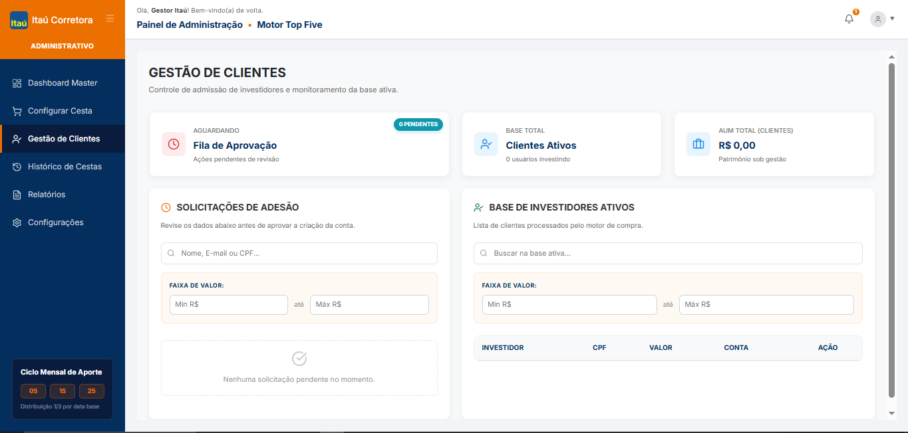
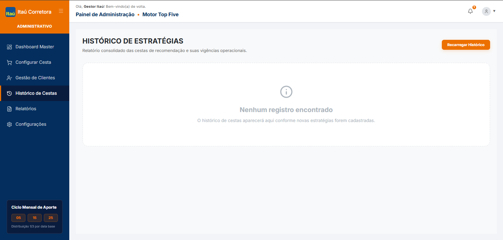

<div align="center">
  
  <h1>Index5 - Frontend Web (Área Administrativa) </h1>
  <p>Interface de gestão, aprovações e controle de investimentos para a equipe Index5.</p>
</div>

> 📱 **Nota sobre os Clientes:** Este repositório foca exclusivamente na **Área Administrativa Web (Backoffice)** da corretora. O fluxo para os clientes finais (Dashboard, aportes, pause, rendimentos, etc) está implementado na nossa **Aplicação Mobile**. Para acessar o projeto Mobile, dirija-se ao repositório: [Index5-Mobile (GitHub)](https://github.com/jeancharlesexe/index5-mb).

---

<br/>

## 📖 Sobre o Projeto Web

O **Index5-FE Web** é a interface dedicada ao controle administrativo do ecossistema Index5. A aplicação foi pensada como uma SPA (*Single Page Application*) que fornece fluxos seguros para diretores e analistas internos gerenciarem e supervisionarem a plataforma. Ela permite:

- **� Login Corporativo:** Identificação baseada no padrão interno de JKey (matrícula).
- **📝 Aprovação de Cadastros (`DashboardMaster` / Fila Pendente):** Após o usuário se inscrever via aplicativo Mobile, ele cai num cofre virtual (estado pendente). Um administrador pode analisar, visualizar detalhes, e aprovar a entrada real ao Fundo Index5 com um único clique.
- **📈 Visualização de Cestas Mensais (Tickets):** Tela para auditar quais são as ações (e os pesos sugeridos) da cesta recomendada que ditará a rentabilidade de todo o fundo e será rodada pela *Engine de Compras* do banco.

> Desenvolvido com foco em **Performance**, **Reusabilidade de Componentes**, **Segurança** e **Experiência do Usuário (UX)** para backoffices.

<br/>

## 📸 Fluxograma das Telas Administrativas

*Adicione os prints das telas Web abaixo apontando os caminhos da imagem real.*

| 🔒 Tela de Login Institucional | 📊 Dashboard Master | ⚙️ Configurar Cesta |
| :---: | :---: | :---: |
|  |  |  |
| *Logins usando JKey e Senha* | *Visão holística da plataforma.* | *Criação da sugestão de ativos mensais.* |

<br/>

| 👥 Gestão de Clientes | 📜 Histórico de Cestas |
| :---: | :---: |
|  |  |
| *Exigência de aprovações cadastrais.* | *Auditoria das cestas prévias da corretora.* |

<br/>

## � Como Inicializar o Sistema (Criando o Primeiro Administrador via Insomnia)

Por padrão, a aplicação exige uma checagem restrita de `Role` (Papel). A plataforma começará **100% vazia**, sem nenhum usuário. Para conseguir realizar o seu primeiro login nesta ferramenta Web e gerir o sistema, você precisará cadastrar manualmente um Administrador comunicando-se diretamente com a API do Backend.

Você deve usar o [Insomnia](https://insomnia.rest/) ou Postman para disparar o Request:

### Cadastrando o Administrador (Endpoint de Auth)
Abra o seu cliente HTTP, garanta que a API local esteja rodando (ex: na porta `5246`) e configure o endpoint e body abaixo:

**`POST`** `http://localhost:5246/api/v1/auth/register`

🖥️ **Body em formato JSON:**
```json
{
  "name": "Jean Itaú",
  "cpf": "12345678900",
  "email": "jean_admin@itau.com.br",
  "birthDate": "2005-08-25",
  "jKey": "J123456", 
  "password": "SenhaSuperForte123!",
  "role": "ADMIN"
}
```
**(Nota: Para um Admin ser aceito no fluxo, as propriedades `role: "ADMIN"` e **obrigatoriamente o código de matrícula** `jKey` devem ser declarados).*

Você deverá receber um Status **`201 Created`**. Pronto! Você já tem as chaves da casa.

---

## � Entrando na Aplicação Web (Login)

De posse das credenciais recém criadas, abra a aplicação Web. Na tela inicial:

1. Acesse a aba/botão que sinaliza **Administrativo** (caso exista separação) ou preencha o formulário institucional.
2. Identificação: Coloque o JKey cadastrado na API (`J00588X` do exemplo acima).
3. Senha: A senha gerada na request HTTP.

Se o Token JWT de Admin for decodificado corretamente, o roteador Web permitirá que você chegue nos painéis privativos mencionados na área de capturas de tela, redirecionando automaticamente para a **Fila de Aprovação de Clientes (Home)**.

---

## 🛠️ Stack Tecnológico Frontend

A aplicação FrontEnd administrativa foi criada com um ferramental minimalista de altíssima performance (`React 19` + `Vite`):

- **[React 19](https://react.dev/):** Biblioteca essencial para construção dos componentes de UI da forma mais declarativa.
- **[Vite](https://vitejs.dev/):** Ferramenta ultra otimizada de Build e Dev Server.
- **[React Router v7](https://reactrouter.com/):** Gere as rotas seguras e protege o Dashboard contra usuários não autenticados (Private Routes).
- **[Axios](https://axios-http.com/):** Camada de Interceptors para formatar mensagens de erro corporativas e injetar seu JWT nas chamadas feitas pelo Admin ao servidor.
- **[Lucide React](https://lucide.dev/):** Iconografia em vetor limpa.

---

## ⚙️ Instalação e Execução (Passo a Passo)

### 1. Pré-Requisitos
Você deve ter na sua máquina previamente:
- [Node.js](https://nodejs.org/) (Sugerida versão LTS >= 20.x)
- O [Index5.API Backend](https://github.com/jeancharlesexe/index5) estar instanciado.

### 2. Rodando o Projeto Web Local

Pelo seu terminal, clone o ambiente e instale:

```bash
# Navegue até a pasta do Frontend
cd index5-fe

# Instale os módulos requeridos (Axios, React, Vite) em uma tacada só
npm install

# Inicie o Servidor de Desenvolvimento Web (Vite)
npm run dev
```

### 3. Acesso
Normalmente o Vite entregará a porta na `http://localhost:5173`. Lembrete: Após a tela renderizar em seu navegador, certifique-se de realizar o tutorial do Insomnia **ANTES** de tentar logar, para não receber erros de "Credencial Inválida".

<div align="center">
  <sub>
  Construído por Jean Charles
  </sub>
</div>
